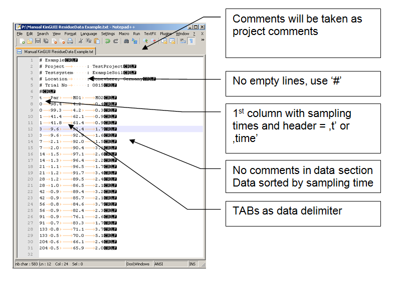
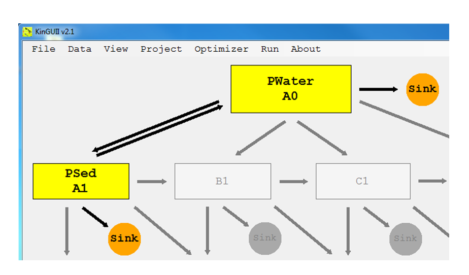

---
title: 4 Data Management
date: "2014-01-01"
config: "../config.yml"
card: True
disqus: True
description: >
  System requirments and installation process.
--- &article2

## 4.1 Workflow

-  Prepare ASCII text file with residue data
-	Load data to workplace
-	Assign compartment residue data to pathway position
-	Connect compartments

## 4.2 Preparation of residue input data

-  Plain ASCII text file
-	Comment lines must contain "#", ":" or "/"
-	You may have as many comment lines as you want
-	No empty lines allowed!
-	1st data column must always contain the sampling times, header for this column must be 't' or 'time'
-	No special chars for compartment names (e.g. space, "?", "\", "*" etc.)
-	Data delimiter: TAB  
delimiter between data colums, 
there may be more than one TAB between two values (for alignment reasons)
Note: tab-separated files can also be prepared using Microsoft Excel. Just save the file as a tab-stop separated .txt file, or copy-paste the data into a .txt file. 
-	No comments in data rows
-	Residue data must be sorted by sampling times
-	Missing data can be left blank or marked as 'NaN' ('not a number')
-	No columns with weights for your data points (will be edited later, std. value = 1)
In general, the residue data should start at t = 0, because M0 (the parameter for the initial concentration) is defined as the concentration at t = 0. 

Example:

## 4.3 Load residue data 

## 4.4  Assign residue data to pathway positions

## 4.5  Weights

## 4.6  Connect Compartments

Just click on the gray arrows to change the compartment connection

- 1st Click: Connect compartment (black arrow)
-	2nd Click: Change direction of the connection
-	3rd Click: Equilibrium reaction (double arrow)
-	4th Click: Break connection (grey arrow)

## 4.7  Save/Load Workspace as XML-file

The complete workspace (model structure and data allocation but excluding project settings) can be saved or loaded at any time to/from an xml file.

