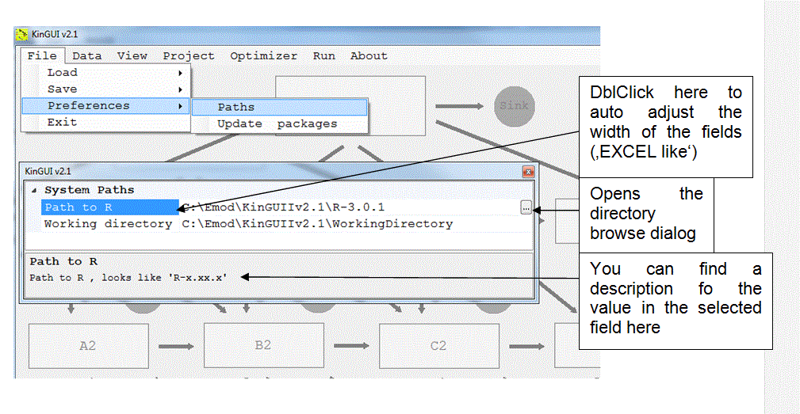

---
title: 3. Getting Started
date: "2014-01-01"
config: "../config.yml"
card: True
disqus: True
description: >
  To perform a kinetic evaluation project go through the following steps.
--- &article2

To perform a kinetic evaluation project go through the following steps:
- Check and define preferences (paths to 'R' and 'Working Directory'). To be done only once. Settings are saved for next uses (section 3.1).
-	Set project details: Define trial path and name, specify type of data 
(degradation, water/sediment) (section 3.2)
-	Load data (section 4.3)
-	Set initial values and choose kinetic models (section 5.2)
-	Choose algorithm for evaluation (section 5.2.4)
-	Run evaluation (section 6.5)
-	View results (section 7)

## 3.1  Set R and Working Directory

## 3.2 Setting Project Details

In the "Project" menu:
- Information about the data set can be entered
- Trial and system path may be defined or changed 
-	It needs to be defined if the data are of type "Soil degradation" or "Water/Sediment Degradation"

