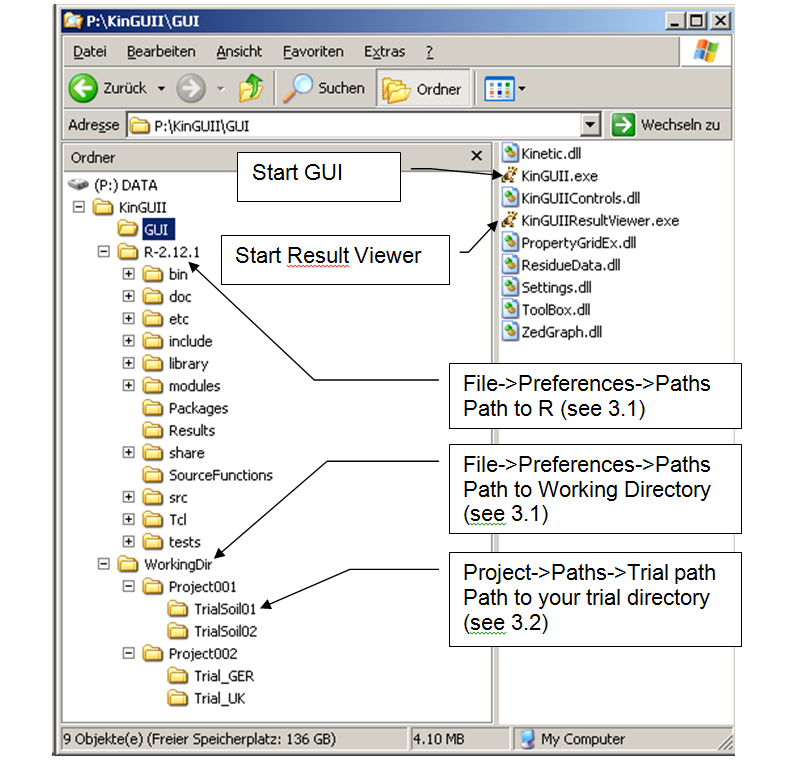

---
title: Installation
date: "2014-01-01"
config: "../config.yml"
card: True
disqus: True
description: >
  System requirments and installation process.
--- &article2

## Requirements

- .Net framework version 4.0 or later. Download here the version for your 
language settings (~ 48MB).
- ~ 140  MB hard disk space 
-	No installed version of 'R' necessary

## Installation

Copy source (e.g. `SourceDrive:\KinGUIIv2.1`) incl. subfolders to your local drive 
-  Do not use network drives! (e.g. `Q`, `M`)
-	Do not use system paths like `C:\Program Files` or `C:\WINDOWS`
-	Check access rights to target path

The resulting directory structure should look like this :

Dblclick `..\KinGUIIv2.1\GUI\KinGUIIv2.1.exe` to start the GUI.

