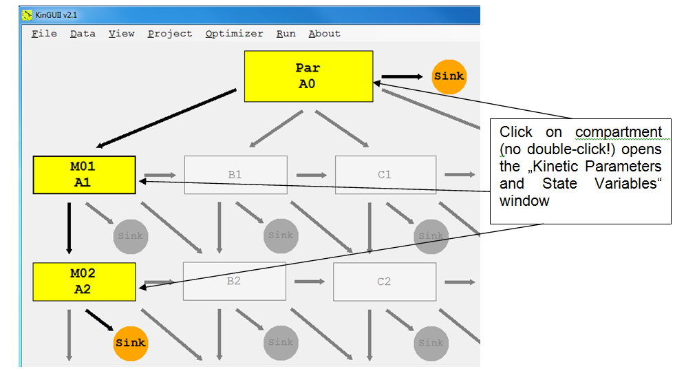
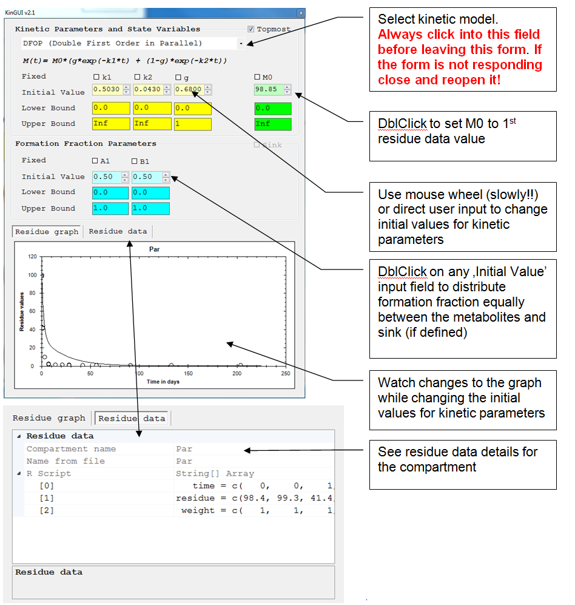

---
title: 5 Kinetic Input
date: "2014-01-01"
config: "../config.yml"
card: True
disqus: True
description: >
  System requirments and installation process.
--- &article2

## 5.1 Workflow

-  Parent
    - Input:
        -	kinetic model: SFO, DFOP, FOMC or HS
        -	'M0' (total amount of chemical present at time = 0 days)
        -	formation fraction
-	Metabolite
    - Only SFO or DFOP allowed
    - Keep M(0) of the metabolite fixed to zero (unless there is reason to do otherwise) 
    - Choose formation fraction
-	Define 'Optimizer'-Settings
    - Optimizer		std  = 'IRLS' (Iteratively reweighted least square)
    - Method		std  = 'LM' (Levenberg-Marquard); alternatively, TRR (trust region approach) can be used

You can check the data input by leaving the entry screen and selecting "View-> R-Script" to see the script file that also echoes the input data.

## 5.2	Kinetic parameters

All kinetic parameters have the same data structure

Fixed 	'TRUE' or 'FALSE'
	std. value ='FALSE'
	Select or unselect the "fixed" checkbox for each parameter
	=> not fixed	: parameter is optimized, starting with the initial value
	=> fixed	: parameter is not optimized, but kept at the initial value

Initial Value 	>= 0
	Enter a (reasonable) initial value for each parameter
	See what the graph would look like with the initial values you have chosen
	Use Mouse Wheel or direct user input

Lower Bound	>= 0
	std. value = 0 

Upper Bound	>= 0, incl. 'Inf' for infinity
	std. value = 'Inf'
	For the formation fractions, the default upper boundary is 1

Use reasonable estimates for the initial values of the parameters. If the initial parameter estimates are too different from the optimal parameter values, the optimization may sometimes converge to a local optimum, especially in case of bi-phasic kinetics or complicated pathways. Repeat the optimization procedure with different initial values and/or a different optimization method if you assume that a better solution exists.
 

### 5.2.1	Input helper

DblClick on
   -	'M0' to set the total amount of chemical present at time = 0 days to the 1st residue data point (only for Parent)
  -	Any formation fraction (initial value input field) to distribute the formation equally between all metabolites (and sink, if defined)

Use mouse wheel (slowly!!) or direct user input to change initial values for kinetic parameters

See what the graph would look like with the parameters you have chosen as initial values.

### 5.2.2  Parent
 
 

### 5.2.3	Metabolite

If several metabolites are formed from one substance for which no sink is defined, and some of these formation fractions shall be fixed, the fixed formation fractions should be the first in the list of formation fraction parameters. 

### 5.2.4	Optimizer Settings

 
Optimizers
Three options are available:
-	NLLS: Classical Nonlinear Least Squares method as implemented in KinGUI 1
-	IRLS:	Iteratively Reweighted Least Squares. Improved algorithm that more realistically estimates parameter confidence intervals (see. Gao et al., 2011, "Improving Uncertainty Analysis in Kinetic Evaluations Using Iteratively Reweighted Least Squares", Environmental Toxicology and Chemistry, 30(10), pp. 2363-2371).
-	MCMC: Markov Chain Monte Carlo method for determination of parameter distributions (see: Görlitz et al., 2011, "Statistical Analysis of Chemical Transformation Kinetics using Markov-Chain Monte-Carlo Methods", Environ. Sci. Technol., 45 (10), pp 4429-4437). CAUTION: This method is very time consuming.

Optimisation methods
Two options are available
-	LM: Levenberg-Marquardt
-	TRR: Trust region optimisation

For all other settings the default values should be used in first instance. Changes should only be made if no successful optimization is achieved. Choosing other methods will usually result in significantly increased processing times.
For the description of the different methods the user is referred to the descriptions of the respective R-packages.

5.3	Water/Sediment studies
For water/sediment studies, the same procedure as for soil studies can be followed in principle. For Level II evaluations (separate water and sediment compartments), make sure that
-	the study type (Project -> Study Type) is set to SwSed. This changes the system representation: rate constants are calculated for each path, instead of substance degradation rate constants & formation fraction.
-	model and data structure are appropriate. The model structure for a Level II-P evaluation is shown in Section 4.6. Accordingly, the data file should contain water and sediment measurements in separate columns.
Note: if the study type is water/sediment, rate constants cannot be fixed. 

