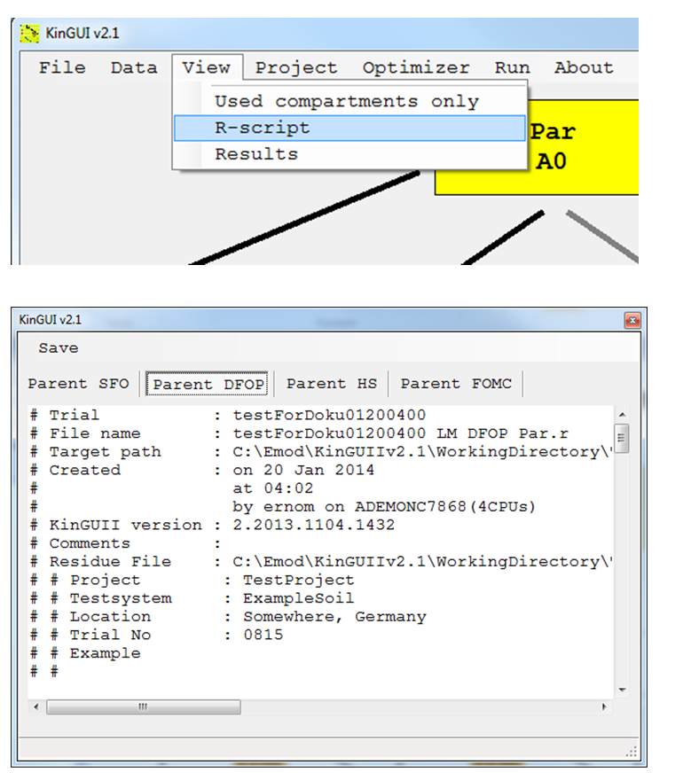
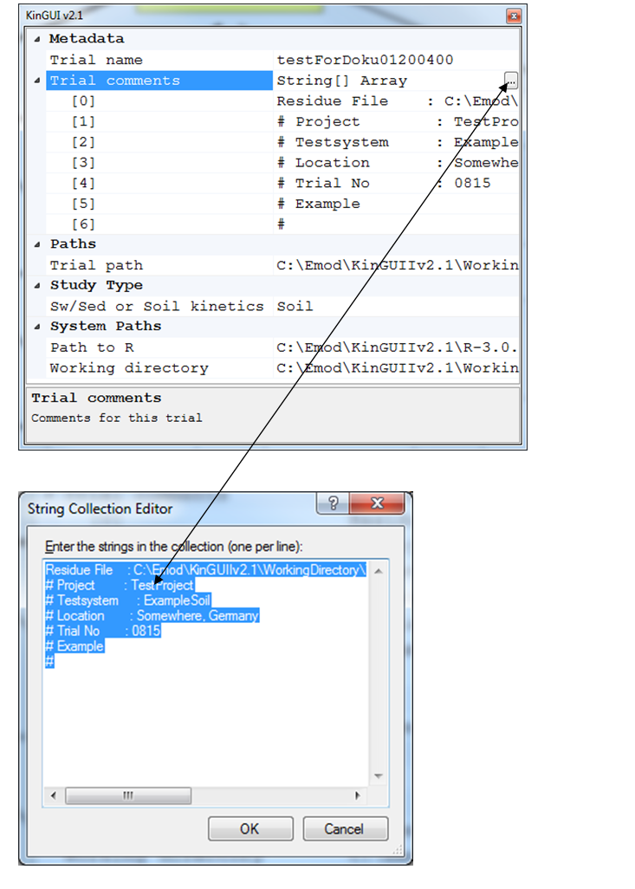
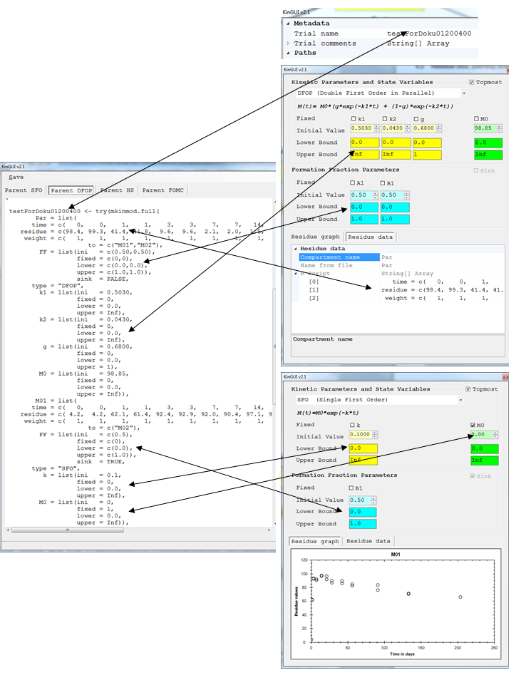
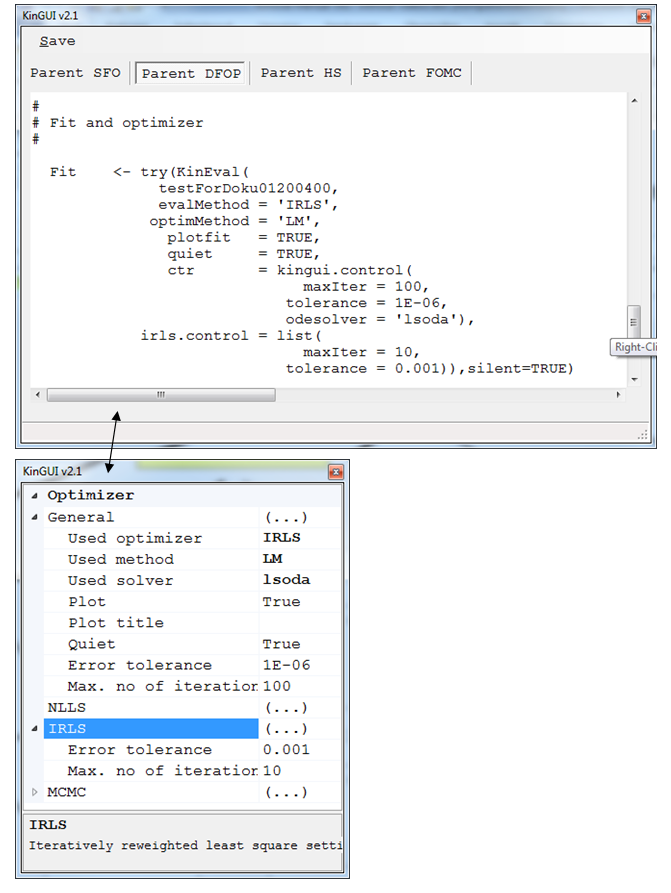
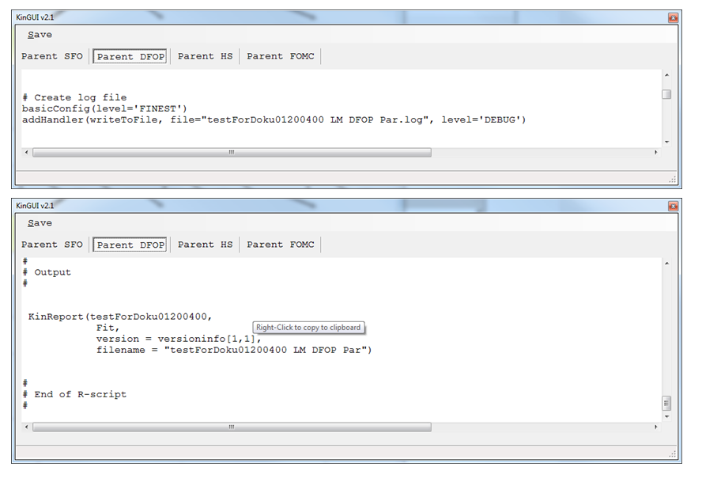
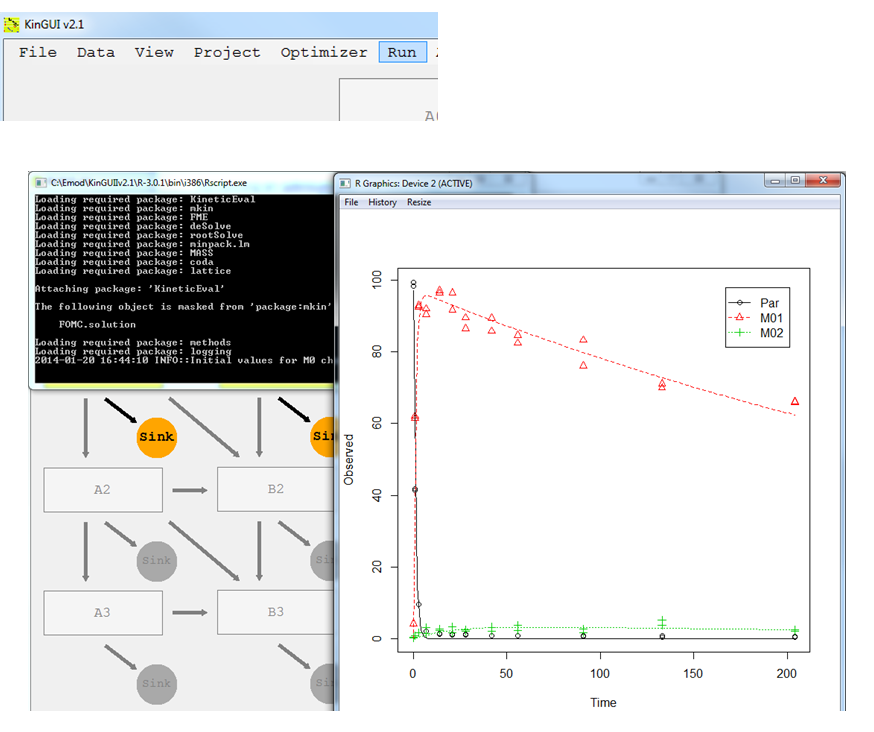

---
title: 6 R Script
date: "2014-01-01"
config: "../config.yml"
card: True
disqus: True
description: >
  System requirments and installation process.
--- &article2

The R-Script contains all parameters and settings for running an optimization. It can be viewed by clicking "R-script" under the "View"-option.
The following explains the structure of the R-Script and how it is compiled with KINGUII v2.1.

 

## 6.1 Metadata

Comments are taken from your residue data file. You can add further comments via
`Projects->Metadata->Trial Comments`.

 

 

## 6.2	'Residue data, pathway and kinetics'

 

 
 
	 
 

## 6.3 Fit and optimizer

 
 

## 6.4 Output

 
Additionally, a log file is created.
 

## 6.5 Run

For running an optimization simply press "Run"

This starts a batch file which executes the created R script(s). 

