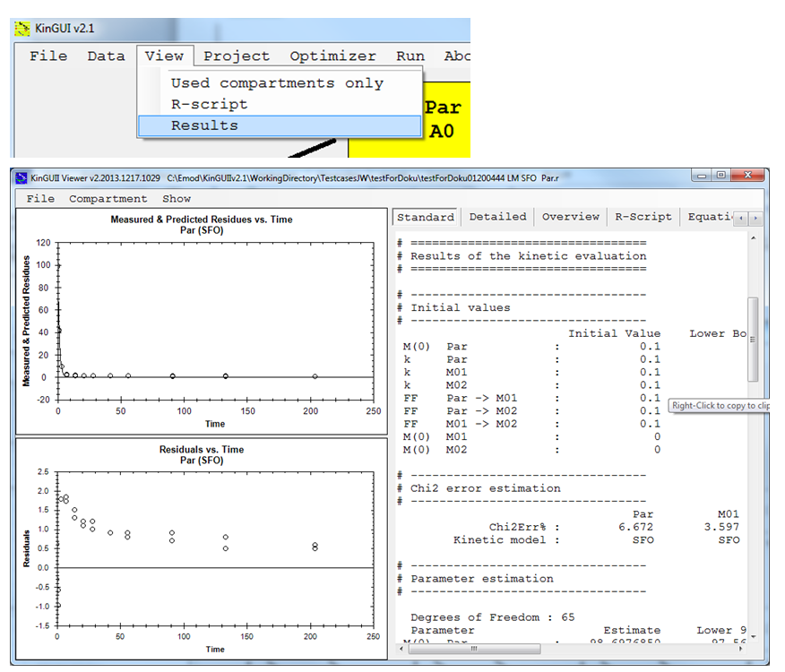
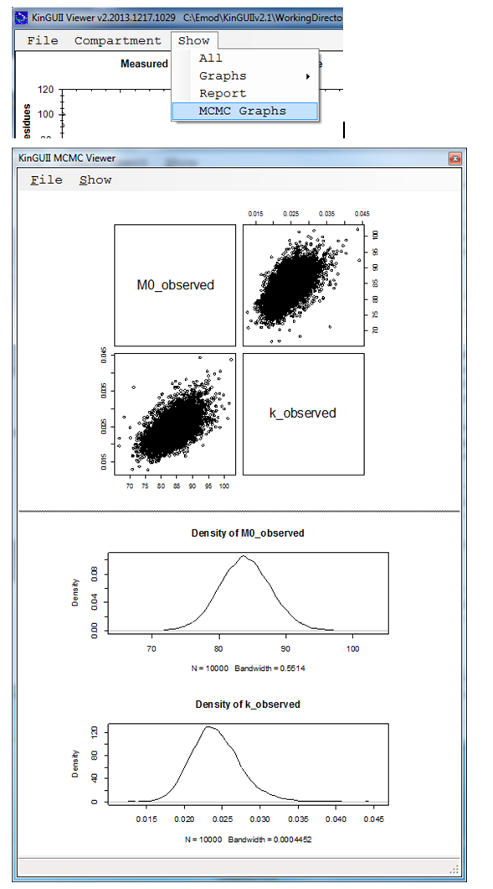

---
title: 7 Results
date: "2014-01-01"
config: "../config.yml"
card: True
disqus: True
description: >
  System requirments and installation process.
--- &article2

The KINGUIIResultViewer is started by "View" -> "Results".
Note: The result viewer can also be used independently by double-clicking 
'..\KinGUIIv2.1\GUI\KINGUIIResultViewer.exe' and loading the R-file of which the results shall be viewed. Several R-files with the same model structure can be selected and viewed together. 

## 7.1	NLLS, IRLS 
The result viewer presents graphs of the observed and calculated data as well as the residuals separately for each compartment (choose under "Compartment") and different views on the calculated results and the underlying R-script. 
All data can be copied or saved after right click on the respective window panel.

 
 
In case of water/sediment data all rates are given separately instead of reporting one rate and formation fractions for different degradation routes (see figure below). From these values DT50values for degradation in the single compartments need to be calculated separately.

 

Graphical output 
The title and axes labels of the graph can be changed via File -> Preferences. E.g. for changing the X-Axis of the plotted fit, change the text displayed in File ->Preferences -> Fit -> X Axis. The changes can saved as default settings via File -> Preferences -> Save to settings.

Section 'Parameter estimation'
The standard output includes the prob > t for all rate constants. For M0, alpha, beta, g and tb, the upper and lower bounds of the 95% confidence interval are returned. 
In the detailed output, prob >t and the bounds of the 95% confidence interval can be viewed for all parameters except the formation fractions. Note, however, that this additional output makes sense only in exceptional cases: 
-	The 95% confidence interval cannot be used to determine whether rate constants are significantly different from 0 according to FOCUS kinetics. If the 95% confidence interval includes zero, this corresponds to a single-sided t-test at 2.5% significance level. The criterion defined in FOCUS kinetics is a 5% significance level of the single-sided t-test. 
-	For the parameters which are no rate constants, a t-test may only be meaningful if equality to zero can occur and shall be tested. 

__Section 'DT50 and DT90 values'__

The DT50 and DT90 values shown in this section are those for dissipation from the respective compartement (e.g. used for trigger purpose). For bi-phasic kinetics, they are different from the DT50 values used for modelling purpose, which are shown in the 'overview'.
 

## 7.2	MCMC 

For runs with MCMC additionally a correlation and a density graph is available.
 

 

